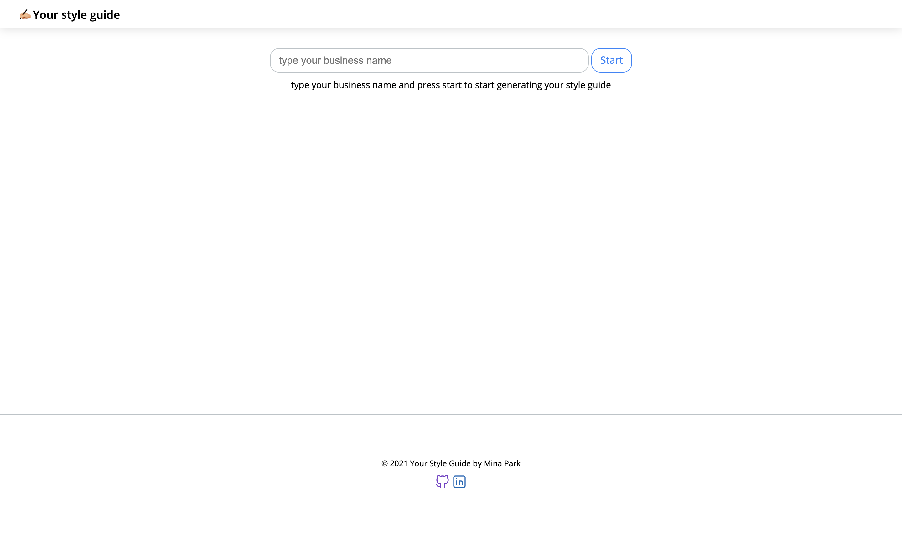
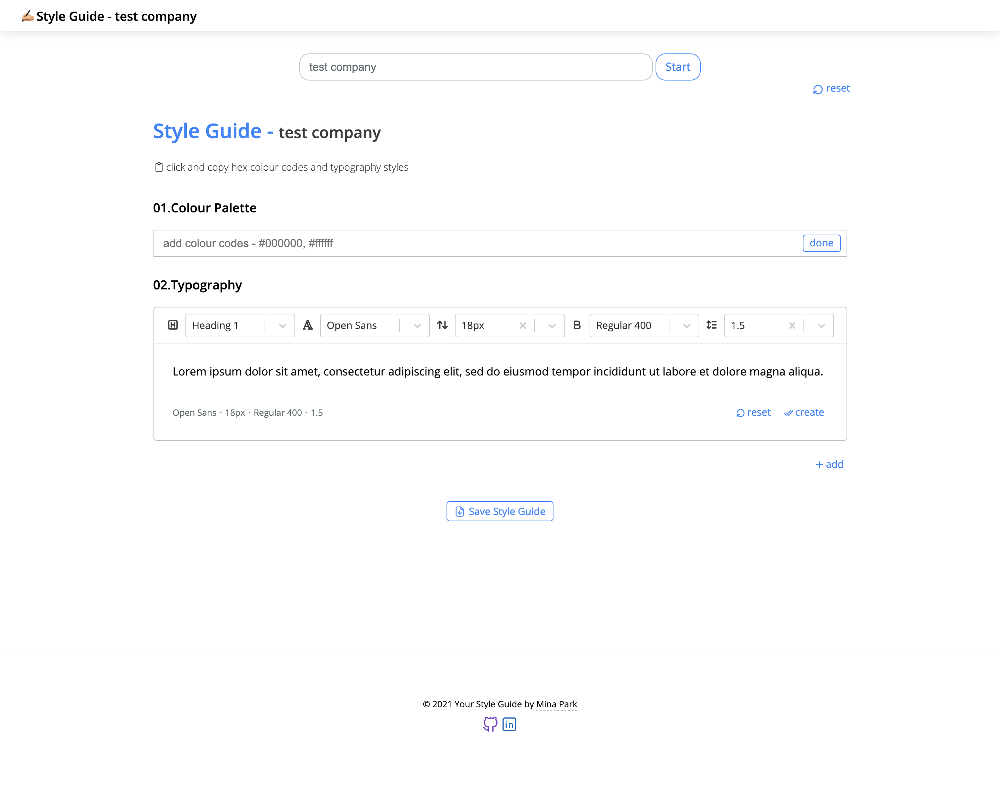
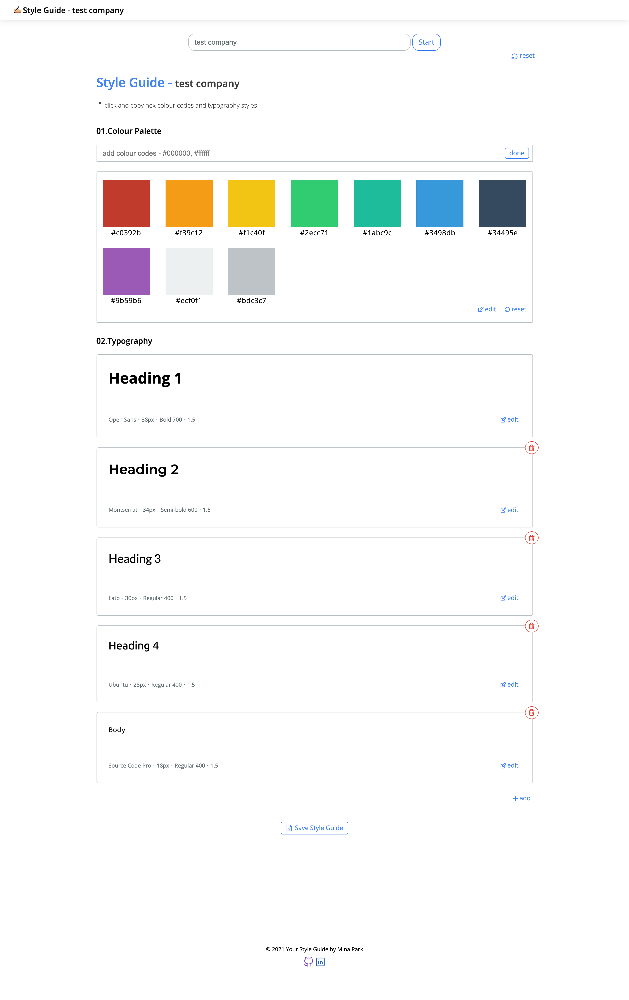
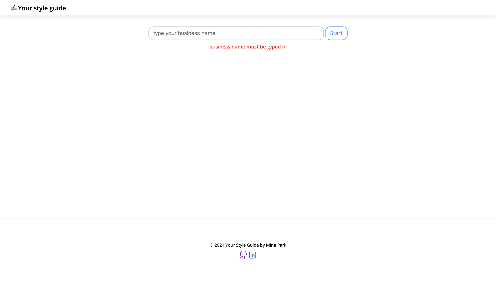

# your style guide

## generate your style guide with this simple app

👉🏻 Colour palette

👉🏻 Typography

---

| Home                                                               |
| :----------------------------------------------------------------- |
|  |

| Create Style Guide                                                                            |
| :-------------------------------------------------------------------------------------------- |
| Create colour palette and select typography settings for different headings                   |
|  |

| Style Guide                                                                      |
| :------------------------------------------------------------------------------- |
| Create your style guide and download it as an image                              |
|  |

| Error                                                           |
| :-------------------------------------------------------------- |
|  |
